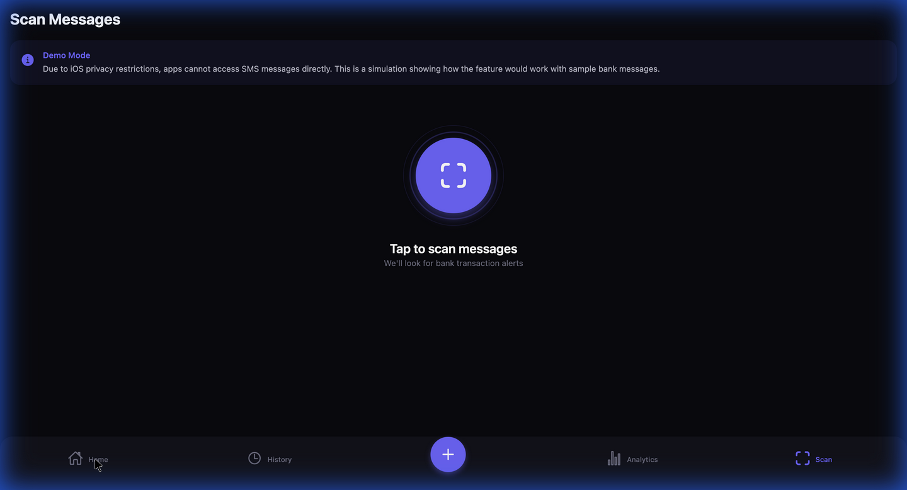
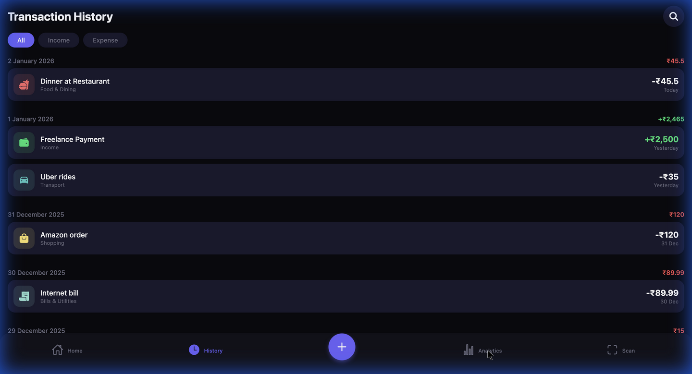
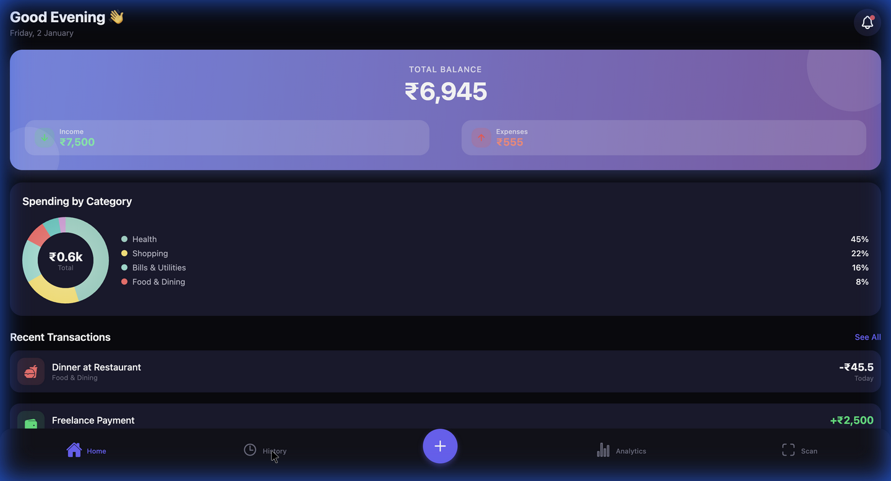
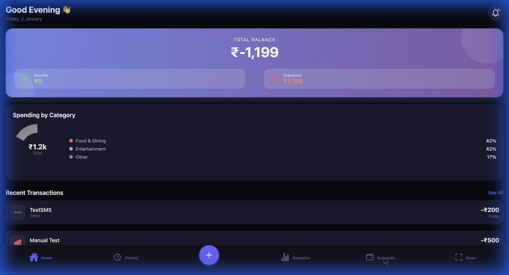
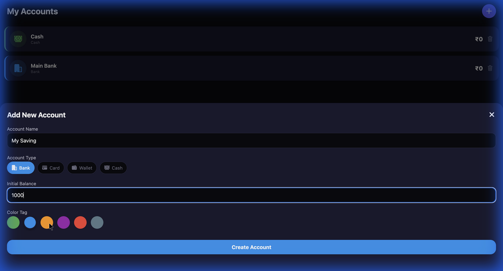
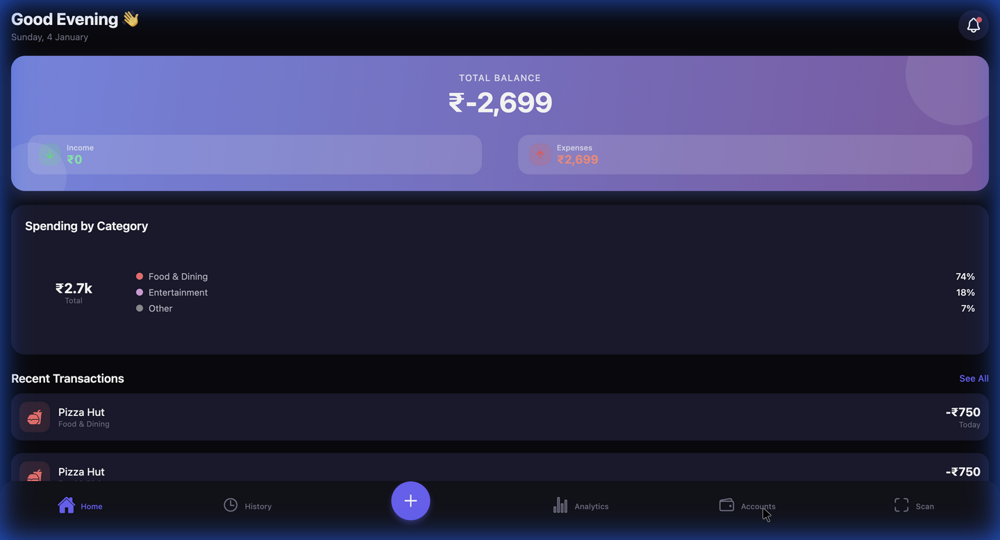

# 🤡 PennyWise
### *Smart Spending, Automagically.*

> "A penny saved is a penny earned." — But we strictly prefer the digital kind.

**PennyWise** is not just another expense tracker. It's an intelligent financial companion for iOS that links directly with your bank SMS to automate your life. Built with a stunning dark-mode-first design, it turns the mundane task of tracking expenses into a delightful experience.

<p align="center">
  
  
</p>

---

## 🎩 The "Magic" (Features)

### ⚡️ Auto-Magical SMS Tracking
Forget manual entry. We've built a bridge between iOS Shortcuts and React Native to parse raw bank SMS messages instantly.
- **Extracts Amount**: Finds the money (`Rs. 750`).
- **Finds Merchant**: Identifies who took your money (`Starbucks`, `Uber`).
- **Links Account**: Smart-matches `HDFC` in the SMS to your **HDFC Bank** account card in the app.

### 🏦 Multi-Account Command Center
Your money lives in different places. Track it all here.
- **Bank Accounts**: Create digital twins for your real bank accounts.
- **Wallets & Cash**: Track physical cash or digital wallets separately.
- **Live Balances**: See exactly how much liquid cash you have across all sources.

### 🎨 A UI You Want to Touch
We obsessed over the details so you don't have to.
- **Haptic Everything**: Feel every interaction with subtle vibrations.
- **Fluid Animations**: Charts that grow, cards that slide, and numbers that tick.
- **Gesture Driven**: Swipe to delete, pull to refresh, tap to expand.

---

## 📸 Visual Tour

### The Dashboard
Your financial health at a glance. The **Glassmorphic Balance Card** updates in real-time as you spend.
<p align="center">
  
  
  
</p>

### Account Management
Add unlimited accounts. Color-code them. Watch them grow (hopefully).
<p align="center">
  
  
</p>

---

## 🧠 How It Works (The Shortcuts Integration)

Apple doesn't let apps read your SMS. So we built a workaround that feels like magic.

1.  **The Trigger**: Your bank sends an SMS: *"Debited Rs 500 for Pizza"*
2.  **The Shortcut**: An iOS Automation wakes up and flings that message to **PennyWise**.
3.  **The Brain**: PennyWise catches the message via a Deep Link, parses the text using Regex, determines the category (Food), finds your matching Bank Account, and records the expense.

**All in under 1 second.**

<p align="center">
  
</p>

*Check the **"Scan"** tab inside the app for a 1-minute setup guide.*

---

## 🛠 Under The Hood

Built with love and:
- **React Native (Expo SDK 52)**: The solid foundation.
- **Expo Router**: File-based routing for smooth navigation.
- **Reanimated**: For those buttery smooth 60fps animations.
- **Gifted Charts**: Data visualization that looks good.
- **AsyncStorage**: Local-first data persistence. Your data stays on your phone.

## 🚀 Run It Yourself

1.  **Clone the repo**
    ```bash
    git clone https://github.com/yourusername/pennywise.git
    cd pennywise
    ```

2.  **Install the goods**
    ```bash
    npm install
    ```

3.  **Launch**
    ```bash
    npx expo start
    ```
    *Scan the QR code with your iPhone using the Expo Go app.*

---

<p align="center">
  Made with ❤️ by Ashin Shanly
</p>
